# Hybrid Activity Recognition with Deep Learning and Handcrafted Features

**Modular PyTorch framework for time-series activity classification combining deep learned representations with statistical features (TSFEL).**

This repository implements a hybrid architecture that fuses signal embeddings from deep encoders (CNN+LSTM, Transformer) with handcrafted time-series features, evaluated on the [AcTBeCalf](https://zenodo.org/records/13259482) cattle behavior dataset.

---

## Architecture Overview

The framework follows an advanced multi-branch design with domain adaptation and adaptive gating:

```mermaid
graph LR
    %% =========================
    %% Data Inputs
    %% =========================
    X_sig["x_signal (B, C, T)"] 
    X_feat["x_features (B, K)"]

    %% =========================
    %% Processing Branches
    %% =========================
    Enc["SignalEncoder<br/>(PatchTST / Robust)"]
    Proj["Linear Projection<br/>+ LayerNorm + Dropout"]

    %% =========================
    %% Intermediate Latent States
    %% =========================
    z_sig["z_sig (B, D_enc)"]
    z_ts["z_ts (B, D_enc)"]

    %% =========================
    %% Auxiliary Adversarial Path
    %% =========================
    GRL["Gradient Reversal Layer<br/>(GRL, -α)"]
    SubjDisc["Subject Discriminator"]
    SubjLogits["subject_logits"]

    %% =========================
    %% Fusion + Prediction Path
    %% =========================
    Gate["Gate Matrix σ"]
    Fusion["Gated Fusion"]
    z_fused["z_fused (B, D_enc)"]
    Head["MLP Head"]
    Logits["Behaviour Logits"]

    %% =========================
    %% Connections
    %% =========================
    X_sig --> Enc
    X_feat --> Proj
    
    Enc --> z_sig
    Proj --> z_ts
    
    %% Invariance Path
    z_sig --> GRL
    GRL --> SubjDisc
    SubjDisc --> SubjLogits

    %% Fusion Path
    z_sig --> Fusion
    z_ts --> Fusion
    Gate -.->|Dynamic Weighting| Fusion
    
    Fusion --> z_fused
    z_fused --> Head
    Head --> Logits

    %% =========================
    %% Styling
    %% =========================

    %% Input Nodes
    style X_sig fill:#E8EEF8,stroke:#4A6FA5,stroke-width:1.5px,color:#111
    style X_feat fill:#E8EEF8,stroke:#4A6FA5,stroke-width:1.5px,color:#111

    %% Encoder / Processing
    style Enc fill:#F4F6F8,stroke:#5B6575,stroke-width:1.5px,color:#111
    style Proj fill:#F4F6F8,stroke:#5B6575,stroke-width:1.5px,color:#111

    %% Latent States
    style z_sig fill:#FFFFFF,stroke:#7A7A7A,stroke-width:1.2px,color:#111
    style z_ts fill:#FFFFFF,stroke:#7A7A7A,stroke-width:1.2px,color:#111
    style z_fused fill:#FFFFFF,stroke:#7A7A7A,stroke-width:1.2px,color:#111

    %% Adversarial Path
    style GRL fill:#FFF3F3,stroke:#C94F4F,stroke-width:1.5px,stroke-dasharray: 5 5,color:#111
    style SubjDisc fill:#FAFAFA,stroke:#8A8A8A,stroke-width:1.3px,color:#111
    style SubjLogits fill:#FDECEC,stroke:#C94F4F,stroke-width:1.5px,color:#111

    %% Fusion / Output
    style Gate fill:#F8F8F8,stroke:#888,stroke-width:1.2px,color:#111
    style Fusion fill:#EEF3EC,stroke:#5E8C61,stroke-width:1.5px,color:#111
    style Head fill:#EEF3EC,stroke:#5E8C61,stroke-width:1.5px,color:#111
    style Logits fill:#E7F0FD,stroke:#4A6FA5,stroke-width:1.8px,color:#111
```



**Three operational modes:**
- **`deep_only`**: Encoder → Head (TSFEL branch disabled)
- **`hybrid`**: Encoder + TSFEL Projection → Gated Fusion → Head (Default SOTA setting)
- **`tsfel_only`**: TSFEL Projection Branch → Head (Raw signal tensor bypassed)

**Encoder families:**
- `cnn_lstm`: 2 Conv1D blocks + 2-layer BiLSTM with last-timestep aggregation.
- `robust`: Optimized 3 Conv1D blocks + 1-layer BiLSTM featuring a preserved temporal resolution (~37 timesteps), 0.4 dropout, and Temporal Attention Pooling.
- `patchtst`: Transformer with overlapping patch tokenization (`patch_len=15, stride=5`) and token-attention aggregation pooling.

**Key SOTA Enhancements:**
- **Gated Multimodal Fusion (GMU):** Replaces naive feature concatenation in `hybrid` mode with a learnable gating mechanism that dynamically weights deep temporal representations against hand-crafted features on a per-window basis.
- **Subject-Adversarial Domain Adaptation (DANN):** Integrates a Gradient Reversal Layer (GRL) connected to an auxiliary Subject Discriminator to actively strip individual calf signatures from the latent space, forcing the encoder to extract pure kinematic behavior.
- **Subject-Wise Shrinkage Normalization:** Implements a local standardization pipeline using empirical Bayesian shrinkage ($w = \frac{n}{n + \tau}$) to neutralize out-of-distribution subject shifts at the test boundary.

**Experimental Grid:** Comprehensive evaluation spanning across deep encoder variations, standalone handcrafted baselines (Random Forest and TSFEL+MLP), and a final Logistic Stacking Ensemble Meta-Learner combining deep probabilities with tree-based descriptors.

---

## Installation

```bash
git clone <repository-url>
cd hybrid_activity_recognition
python3 -m venv venv
source venv/bin/activate
pip install -U pip
pip install -r requirements.txt
```

**Requirements:**
- Python ≥3.10
- PyTorch ≥2.0 (see [pytorch.org](https://pytorch.org) for CUDA-specific builds)
- `transformers>=4.36.0` (PatchTST support)
- `tsfel`, `scikit-learn`, `pandas`, `pyarrow`

---

## Quick Start

### Default Flow (Recommended)

Run this sequence end-to-end:

```bash
# 0) Environment
source venv/bin/activate
export PYTHONPATH=src

# 1) Raw CSV → train/test (subject-disjoint split via genSplit)
python scripts/dataset_processing.py \
  --csv dataset/AcTBeCalf.csv \
  --out-dir dataset/processed \
  --split-by behavior \
  --subject-column calfId \
  --behavior-column behaviour \
  --test-fraction 0.2

# 2) Window train (discover TSFEL top-K features + save manifest)
python scripts/prepare_windowed_parquet.py \
  --input dataset/processed/AcTBeCalf/train.parquet \
  --output dataset/processed/AcTBeCalf/windowed_train.parquet \
  --feature-manifest-out dataset/processed/AcTBeCalf/tsfel_feature_manifest.json

# 3) Window test (apply same TSFEL columns from manifest)
python scripts/prepare_windowed_parquet.py \
  --input dataset/processed/AcTBeCalf/test.parquet \
  --output dataset/processed/AcTBeCalf/windowed_test.parquet \
  --feature-manifest-in dataset/processed/AcTBeCalf/tsfel_feature_manifest.json

# 4) Run full experimental grid
bash scripts/experiments/run_all.sh
```

### 1. Prepare Data

**Step 1a: Split raw CSV by behavior (subject-disjoint split via `genSplit`)**

```bash
python scripts/dataset_processing.py \
  --csv dataset/AcTBeCalf.csv \
  --out-dir dataset/processed
```

Output: `dataset/processed/AcTBeCalf/{train,test}.parquet` (long-form time series) and **`split_report.json`**: total row counts, `train_ids` / `test_ids` (subjects), per-split behaviour **counts** and **proportions**, plus method metadata (`genSplit` details when applicable).

Default `--split-by behavior`: **disjoint calves** (`--subject-column`, default `calfId`): the test set is chosen with `genSplit.find_optimal_calf_combinations_for_split` so that, per class, the ratio (test counts / train counts) stays close to `test_fraction / (1 - test_fraction)`, with no random row sampling. This matches the holstein-style protocol (see `scripts/genSplit.py`).

- For a **fixed list** of test animals, use `--split-by subject --test-subjects ...`.

**Step 1b: Window + extract TSFEL features**

Training set (discovers top-K features, saves manifest):

```bash
python scripts/prepare_windowed_parquet.py \
  --input dataset/processed/AcTBeCalf/train.parquet \
  --output dataset/processed/AcTBeCalf/windowed_train.parquet \
  --feature-manifest-out dataset/processed/AcTBeCalf/tsfel_feature_manifest.json
```

Test set (applies same features from manifest):

```bash
python scripts/prepare_windowed_parquet.py \
  --input dataset/processed/AcTBeCalf/test.parquet \
  --output dataset/processed/AcTBeCalf/windowed_test.parquet \
  --feature-manifest-in dataset/processed/AcTBeCalf/tsfel_feature_manifest.json
```

### 2. Train a Model

**Example: Robust CNN+LSTM hybrid**

```bash
export PYTHONPATH=src
python -m hybrid_activity_recognition.main \
  --mode supervised \
  --model robust \
  --input_mode hybrid \
  --labeled_parquet_train dataset/processed/AcTBeCalf/windowed_train.parquet \
  --labeled_parquet_test dataset/processed/AcTBeCalf/windowed_test.parquet \
  --output_dir experiments/my_run \
  --epochs 50 \
  --batch_size 64 \
  --device cuda
```

**Example: PatchTST with MAE pretraining**

```bash
# 1. MAE pretraining (masked auto-encoding, unlabeled signals)
PYTHONPATH=src python -m hybrid_activity_recognition.main \
  --mode pretrain \
  --pretrain_parquet dataset/processed/AcTBeCalf/windowed_train.parquet \
  --output_dir experiments/patchtst_pretrain \
  --pretrain_epochs 100 \
  --batch_size 64 \
  --device cuda

# 2. Supervised fine-tuning (hybrid mode)
PYTHONPATH=src python -m hybrid_activity_recognition.main \
  --mode supervised \
  --model patchtst \
  --input_mode hybrid \
  --patchtst_checkpoint experiments/patchtst_pretrain/best.pt \
  --labeled_parquet_train dataset/processed/AcTBeCalf/windowed_train.parquet \
  --labeled_parquet_test dataset/processed/AcTBeCalf/windowed_test.parquet \
  --output_dir experiments/patchtst_hybrid \
  --epochs 50 \
  --device cuda
```

**Example: CNN+LSTM (or Robust) with TS2Vec contrastive pretraining**

Self-supervised pretraining for CNN+LSTM-family encoders. Produces a checkpoint loadable via `--init_encoder_from`. PatchTST is not supported here — use `--mode pretrain` (MAE) above instead.

```bash
# 1. TS2Vec contrastive pretraining (unlabeled signals)
PYTHONPATH=src python -m hybrid_activity_recognition.main \
  --mode pretrain_ts2vec \
  --model cnn_lstm \
  --pretrain_parquet dataset/processed/AcTBeCalf/windowed_train.parquet \
  --output_dir experiments/ts2vec_cnn_lstm \
  --pretrain_epochs 100 \
  --device cuda

# 2. Supervised run initialized from the TS2Vec encoder
PYTHONPATH=src python -m hybrid_activity_recognition.main \
  --mode supervised \
  --model cnn_lstm \
  --input_mode hybrid \
  --init_encoder_from experiments/ts2vec_cnn_lstm/ts2vec_best.pt \
  --labeled_parquet_train dataset/processed/AcTBeCalf/windowed_train.parquet \
  --labeled_parquet_test dataset/processed/AcTBeCalf/windowed_test.parquet \
  --output_dir experiments/cnn_lstm_hybrid_ts2vec \
  --device cuda
```

Note: if you override `--hidden_lstm`, use the same value in both the pretrain and supervised run so encoder state_dict keys align.

### 3. Run Full Experimental Grid

**Smoke test (2 epochs, validates everything works):**

```bash
bash scripts/experiments/smoke_test.sh
```

**Full grid (500 epochs, all experiments):**

```bash
bash scripts/experiments/run_all.sh
```

**For remote execution via SSH:**

```bash
# Option 1: nohup
nohup bash scripts/experiments/run_all.sh > logs/run_all.log 2>&1 &
disown

# Option 2: screen (recommended, allows reconnection)
screen -dmS experiments bash scripts/experiments/run_all.sh
# Reconnect: screen -r experiments

# Option 3: tmux
tmux new -d -s experiments 'bash scripts/experiments/run_all.sh'
# Reconnect: tmux attach -t experiments
```

---

## CLI Reference

### Main Entry Point

```bash
PYTHONPATH=src python -m hybrid_activity_recognition.main --help
```

**Key arguments:**

| Argument | Values | Description |
|----------|--------|-------------|
| `--mode` | `supervised`, `pretrain`, `pretrain_ts2vec`, `finetune`, `test` | Training mode |
| `--model` | `cnn_lstm`, `robust`, `patchtst`, `tsfel_mlp` | Encoder family |
| `--input_mode` | `deep_only`, `hybrid`, `tsfel_only` | Architecture mode (default: `hybrid`) |
| `--labeled_parquet_train` | path | Windowed training parquet |
| `--labeled_parquet_test` | path | Windowed test parquet |
| `--pretrain_parquet` | path | Windowed parquet for pretraining (`pretrain` / `pretrain_ts2vec` modes) |
| `--checkpoint` | path | Resume supervised/pretrain from this checkpoint |
| `--patchtst_checkpoint` | path | Pretrained PatchTST MAE checkpoint to load into encoder |
| `--init_encoder_from` | path | Load encoder weights from a TS2Vec checkpoint |
| `--output_dir` | path | Output directory for checkpoints and logs |
| `--epochs` | int | Max supervised/finetune epochs (default: 100) |
| `--pretrain_epochs` | int | Pretraining epochs (default: 40) |
| `--batch_size` | int | Batch size (default: 64) |
| `--lr` | float | Learning rate (default: 1e-3 supervised, 1e-4 finetune) |
| `--device` | `cuda`, `cpu` | Device (default: `cuda`) |
| `--seed` | int | Random seed (default: 2026) |
| `--freeze_encoder` | flag | Freeze signal encoder during supervised/finetune |
| `--no_class_weights` | flag | Disable balanced class weights in CE loss |
| `--signal_norm` | `global` (SOTA: `subject`) | Activates subject-wise local normalization with shrinkage |
| `--norm_shrinkage_tau` | `50` | Shrinkage regularization weight for unseen test subjects |
| `--fusion` | `concat` (SOTA: `gated`) | Activates Gated Multimodal Unit (GMU) adaptive pooling |
| `--loss_criterion` | `weighted_ce` (SOTA: `focal`) | Replaces standard CE with Focal Loss to fight class imbalance |
| `--apply_augmentation` | flag | Activates online supervised data augmentation (*jitter* & *scale*) |
| `--adversarial_subject_alignment` | flag | Enables DANN framework to enforce calf-invariant embeddings |
| `--adversarial_beta` | `0.1` | Loss weight balance factor for the adversarial subject path |

**PatchTST-specific:**

| Argument | Default | Description |
|----------|---------|-------------|
| `--context_length` | 75 | Window length T |
| `--patch_len` | 12 | Patch length |
| `--stride` | 12 | Patch stride |
| `--n_layers` | 3 | Transformer layers |
| `--n_heads` | 16 | Attention heads |
| `--d_model` | 128 | Model dimension |
| `--d_ff` | 512 | FFN dimension |
| `--dropout` | 0.2 | Attention + FF dropout |
| `--head_dropout` | 0.2 | Classification head dropout |
| `--revin` | 1 | Reversible instance normalization (0/1) |
| `--mask_ratio` | 0.75 | MAE masking ratio (`--mode pretrain`) |

**TS2Vec-specific:**

| Argument | Default | Description |
|----------|---------|-------------|
| `--temporal_unit` | 0 | Minimum pooling scale for temporal contrast |
| `--hidden_lstm` | None | LSTM hidden size override (must match pretrain + supervised) |

---

## Experimental Workflow

### Data Preprocessing

**Input:** Raw CSV with columns `dateTime`, `calfId`, `segId`, `accX`, `accY`, `accZ`, `behaviour`.

**Pipeline:**

1. **Train/test split** (default: `genSplit`-style disjoint subjects + label proportions; see Step 1a):
   ```bash
   python scripts/dataset_processing.py \
     --csv dataset/AcTBeCalf.csv \
     --out-dir dataset/processed
   ```

   To force split by subject:
   ```bash
   python scripts/dataset_processing.py \
     --csv dataset/AcTBeCalf.csv \
     --out-dir dataset/processed \
     --split-by subject \
     --subject-column calfId \
     --test-subjects 1329 1343 1353 1357 1372
   ```

2. **Windowing + TSFEL** (discover on train, apply on test):
   ```bash
   # Train: discover top-75 features
   python scripts/prepare_windowed_parquet.py \
     --input dataset/processed/AcTBeCalf/train.parquet \
     --output dataset/processed/AcTBeCalf/windowed_train.parquet \
     --feature-manifest-out dataset/processed/AcTBeCalf/tsfel_feature_manifest.json \
     --window-size 75 --overlap 0.5 --purity-threshold 0.9 --fs 25

   # Test: apply same features
   python scripts/prepare_windowed_parquet.py \
     --input dataset/processed/AcTBeCalf/test.parquet \
     --output dataset/processed/AcTBeCalf/windowed_test.parquet \
     --feature-manifest-in dataset/processed/AcTBeCalf/tsfel_feature_manifest.json
   ```

**Normalization:** Signal z-score and TSFEL StandardScaler are fitted **only** on training windows (no test leakage).

### Training Modes

**Supervised (from scratch):**

```bash
PYTHONPATH=src python -m hybrid_activity_recognition.main \
  --mode supervised \
  --model robust \
  --input_mode hybrid \
  --labeled_parquet_train dataset/processed/AcTBeCalf/windowed_train.parquet \
  --labeled_parquet_test dataset/processed/AcTBeCalf/windowed_test.parquet \
  --output_dir experiments/robust_run1 \
  --epochs 200 --lr 1e-3 --device cuda
```

**Pretrain + Fine-tune (PatchTST):**

```bash
# 1. MAE pretraining (unlabeled data)
PYTHONPATH=src python -m hybrid_activity_recognition.main \
  --mode pretrain \
  --pretrain_parquet dataset/processed/AcTBeCalf/windowed_train.parquet \
  --output_dir experiments/patchtst_pretrain \
  --pretrain_epochs 100 --pretrain_lr 1e-3 --device cuda

# 2. Supervised
PYTHONPATH=src python -m hybrid_activity_recognition.main \
  --mode supervised \
  --model patchtst --input_mode hybrid \
  --patchtst_checkpoint experiments/patchtst_pretrain/best.pt \
  --labeled_parquet_train dataset/processed/AcTBeCalf/windowed_train.parquet \
  --labeled_parquet_test dataset/processed/AcTBeCalf/windowed_test.parquet \
  --output_dir experiments/patchtst_hybrid \
  --epochs 500 --device cuda
```

**TS2Vec Pretrain + Supervised (CNN+LSTM / Robust):**

```bash
# 1. Pretrain
PYTHONPATH=src python -m hybrid_activity_recognition.main \
  --mode pretrain_ts2vec \
  --model cnn_lstm \
  --pretrain_parquet dataset/processed/AcTBeCalf/windowed_train.parquet \
  --output_dir experiments/ts2vec_cnn_lstm \
  --pretrain_epochs 100 --device cuda

# 2. Supervised
PYTHONPATH=src python -m hybrid_activity_recognition.main \
  --mode supervised \
  --model cnn_lstm --input_mode hybrid \
  --init_encoder_from experiments/ts2vec_cnn_lstm/ts2vec_best.pt \
  --labeled_parquet_train dataset/processed/AcTBeCalf/windowed_train.parquet \
  --labeled_parquet_test dataset/processed/AcTBeCalf/windowed_test.parquet \
  --output_dir experiments/cnn_lstm_hybrid_ts2vec \
  --epochs 500 --device cuda
```

**Resume interrupted training:**

```bash
PYTHONPATH=src python -m hybrid_activity_recognition.main \
  --mode supervised \
  --model robust --input_mode hybrid \
  --checkpoint experiments/robust_run1/checkpoint.pt \
  --labeled_parquet_train dataset/processed/AcTBeCalf/windowed_train.parquet \
  --labeled_parquet_test dataset/processed/AcTBeCalf/windowed_test.parquet \
  --output_dir experiments/robust_run1 \
  --epochs 200 --device cuda
```

**Test only (evaluate a saved checkpoint):**

```bash
PYTHONPATH=src python -m hybrid_activity_recognition.main \
  --mode test \
  --model robust --input_mode hybrid \
  --checkpoint experiments/robust_run1/best.pt \
  --labeled_parquet_train dataset/processed/AcTBeCalf/windowed_train.parquet \
  --labeled_parquet_test dataset/processed/AcTBeCalf/windowed_test.parquet \
  --output_dir experiments/robust_run1
```

---

## Automated Experiments

### Smoke Test (Quick Validation)

Runs all experiments for **2 epochs** with **10% training data** and batch size 16 — validates that imports, shapes, and I/O work end-to-end without any real training:

```bash
bash scripts/experiments/smoke_test.sh
```

### Full Experimental Grid

```bash
bash scripts/experiments/run_all.sh
```

**Execution order:**
1. CNN+LSTM: TS2Vec pretrain → `deep_only` + `hybrid` (fromscratch + frompretrain ep20/50/100)
2. Robust CNN+LSTM: same as above
3. PatchTST: fromscratch + MAE pretrain → `deep_only` + `hybrid` (multiple init variants)
4. TSFEL-only baseline (Random Forest)
5. TSFEL+MLP baseline

**Individual model scripts:**
- `bash scripts/experiments/run_cnn_lstm.sh`
- `bash scripts/experiments/run_robust.sh`
- `bash scripts/experiments/run_patchtst.sh`
- `bash scripts/experiments/run_tsfel_baseline.sh`
- `bash scripts/experiments/run_tsfel_mlp.sh`

**PatchTST with raw unlabeled data (optional):**

If you have `dataset/Time_Adj_Raw_Data.csv` (unlabeled), you can pretrain PatchTST on it before fine-tuning:

```bash
# Pretrain on raw CSV + run patchtst_hybrid_frompretrain
bash scripts/experiments/run_patchtst_raw_pipeline.sh
```

**Resume behavior:**
- If `checkpoint.pt` exists in the run directory, training automatically resumes from the last epoch.
- If `DONE` marker exists, the experiment is skipped entirely.
- To restart from scratch: delete the run directory or remove `DONE`.

---

### Automated Execution (Windows / PowerShell)

Instead of managing individual Bash scripts manually across multiple data-splitting and training stages, the pipeline is fully automated for PowerShell. It includes **intelligent disk caching**: if windowed Parquets and manifests are already computed, it skips the heavy processing steps ($\approx 50$ minutes) and jumps straight to GPU acceleration.

```powershell
# 1) Open PowerShell inside the repository root and activate your environment
.\venv\Scripts\Activate.ps1

# 2) Run the complete state-of-the-art grid pipeline end-to-end
.\scripts\experiments\run_pipeline_raw_data.ps1
```


---

## Checkpointing and Resume

Each training run creates a directory named with key hyperparameters:

```
experiments/{model}_{mode}[_{suffix}]_{dataset}_ep{epochs}_bs{batch}_lr{lr}_s{seed}/
```

**Files saved:**
- `checkpoint.pt`: Full state (model, optimizer, scheduler, counters) for resume
- `best.pt`: Best model by validation accuracy (weights only)
- `train.log`: Complete training log (console + file)
- `DONE`: Marker indicating successful completion

---

## Testing

**Unit tests (dimension sanity checks):**

```bash
PYTHONPATH=src pytest tests/ -v
```

**Coverage:**
- `test_encoders.py`: Forward pass shape validation for all encoders
- `test_fusion.py`: Fusion, TSFEL branch, and head dimension checks
- `test_hybrid_model.py`: End-to-end forward + gradient flow for all modes

**Runtime:** <5 seconds, no GPU required, no real data needed.

---

## Baseline: TSFEL-only (Random Forest)

Standalone sklearn baseline for comparison (no deep learning):

```bash
PYTHONPATH=src python -m random_forest_baseline.tsfel_baseline \
  --train dataset/processed/AcTBeCalf/windowed_train.parquet \
  --test dataset/processed/AcTBeCalf/windowed_test.parquet \
  --output_dir experiments/tsfel_baseline \
  --n_estimators 200
```

**Method:** SelectKBest (f_classif) + RandomForestClassifier with balanced class weights.

---

## Customization

### Adding a New Encoder

1. Implement `SignalEncoder` in [src/hybrid_activity_recognition/models/encoders.py](src/hybrid_activity_recognition/models/encoders.py):
   ```python
   class MyEncoder(SignalEncoder):
       @property
       def output_dim(self) -> int:
           return self._dim

       def forward(self, x_signal: Tensor) -> Tensor:
           # x_signal: (B, 3, T)
           # return: (B, output_dim)
           ...
   ```

2. Register in [src/hybrid_activity_recognition/models/__init__.py](src/hybrid_activity_recognition/models/__init__.py):
   ```python
   _ENCODER_REGISTRY["my_encoder"] = MyEncoder
   ```

3. Use via CLI:
   ```bash
   --model my_encoder --input_mode hybrid
   ```

### Adding a New Pretraining Method

1. Implement the training loop in `src/hybrid_activity_recognition/training/`.
2. Add a new `--mode pretrain_<name>` branch in [src/hybrid_activity_recognition/main.py](src/hybrid_activity_recognition/main.py).
3. Add any method-specific flags to `parse_args()`.

### Adapting to a New Dataset

1. Ensure raw CSV matches the expected schema (e.g. `dateTime`, `calfId`, `accX`/`accY`/`accZ`, `behaviour`) or adapt column names in the processing scripts.
2. Run the same 3-step pipeline (split → window → train).
3. Update `DATASET_ID` in `scripts/experiments/_common.sh` for proper run naming.

---

## Architecture Details

### Signal Encoders

| Encoder | Architecture | Output Dim | Notes |
|---------|--------------|------------|-------|
| `CNNLSTMEncoder` | 2 Conv1D (64→128) + BiLSTM (2 layers) | `2 × hidden_lstm` (default: 128) | Last timestep aggregation |
| `RobustCNNLSTMEncoder` | 3 Conv1D (64→128→256) + BiLSTM (1 layer) | `2 × hidden_lstm` (default: 256) | h_n concatenation, Kaiming init |
| `PatchTSTEncoder` | Patch tokenization + Transformer | `d_model` (default: 128) | HuggingFace wrapper, mean pooling |
| `RobustCNNLSTMEncoder` | 3 Conv1D blocks + 1-layer BiLSTM | `2 × hidden_lstm` (default: 256) | Preserved resolution to ~37 timesteps, Dropout 0.4, and Temporal Attention Pooling |

### TSFEL Branch

- **`MLPTsfelBranch`**: Identity pass-through — returns the TSFEL feature vector unchanged. Output dim = input dim K.

### Fusion

- **`ConcatFusion`**: Simple concatenation (`output_dim = enc_dim + tsfel_dim`)
- **`GatedFusion`**: Gated Multimodal Unit (GMU) that scales feature activation dynamically based on token context.

### Classification Heads

- **`MLPHead`**: Linear → ReLU → Dropout → Linear (default hidden: 256), Kaiming init
- **`LinearHead`**: Single linear layer
- **`PatchTSTHFClassificationHead`**: HuggingFace head (requires `--model patchtst --input_mode deep_only`)

---

## Output and Metrics

**Per-epoch logging:**
- Training loss, training accuracy
- Validation loss, validation accuracy

**Final test metrics:**
- Accuracy
- Macro F1
- Weighted F1

**Logs:** `{output_dir}/train.log` (console + file).

---

## Reproducibility

- **Seed control:** `--seed` sets `random`, `numpy`, and `torch` seeds.
- **Deterministic ops:** `CUBLAS_WORKSPACE_CONFIG=:4096:8` set by `utils/repro.py`.
- **Data splits:** `dataset_processing.py --split-by behavior` uses **disjoint subjects** and `genSplit.find_optimal_calf_combinations_for_split`. Fixed test herds: `--split-by subject`.
- **Normalization:** Statistics computed only on training set, applied to val/test.
- **TSFEL features:** Manifest ensures test uses the same features as training.

---

## Consolidated Performance Metrics

Our architectural modifications successfully broke through the hand-crafted feature baseline ceiling, achieving state-of-the-art performance for deep models under subject-disjoint validation protocols.

| Model / Architecture | Input Mode | Test Accuracy | Test Macro F1 | Class Balancing Metric |
|----------------------|------------|:-------------:|:-------------:|:----------------------:|
| **PatchTST + DANN (SOTA)** | **Hybrid Gated** | **72.93%** | **0.5485** | **Highly Balanced (Low Std)** |
| Robust CNN-LSTM + DANN | Hybrid Gated | 71.43% | 0.5120 | Balanced |
| **Ensemble (PatchTST + RF)** | **Stacking** | **69.78%** | **0.4800** | Meta-Learner Combined |
| *TSFEL Baseline (Classic)* | *Random Forest* | *69.02%* | *0.4985* | *High Class-Wise Variance* |
| PatchTST + DANN | Deep Only | 66.01% | 0.4225 | High Bias |
| TSFEL MLP Baseline | TSFEL Only | 65.30% | 0.4688 | Imbalanced |
| Robust CNN-LSTM | Deep Only | 62.48% | 0.4064 | Severe Degradation |

--- 

## References

- **PatchTST:** Nie, Y. et al. (2023). "A Time Series is Worth 64 Words: Long-term Forecasting with Transformers." *ICLR 2023*.
- **TS2Vec:** Yue, Z. et al. (2022). "TS2Vec: Towards Universal Representation of Time Series." *AAAI 2022*.
- **TSFEL:** Barandas, M. et al. (2020). "TSFEL: Time Series Feature Extraction Library." *SoftwareX*, 11, 100456.

---

## Troubleshooting

**`FileNotFoundError: windowed_train.parquet`**
→ Run `prepare_windowed_parquet.py` on `train.parquet` first (see Quick Start step 2).

**`Manifest not found`**
→ Run the training set windowing with `--feature-manifest-out` before processing the test set.

**CUDA driver warnings**
→ The code falls back to CPU automatically. To suppress: `export DEVICE=cpu`.

**`TSFEL RuntimeWarning: catastrophic cancellation`**
→ Expected for near-constant signal windows; does not affect results. Suppress with `PYTHONWARNINGS=ignore::RuntimeWarning`.

---

## References

- → DANN / GRL: Ganin, Y. et al. (2016). "Domain-Adversarial Training of Neural Networks." JMLR 2016.

- → GMU Fusion: Arevalo, J. et al. (2017). "Gated Multimodal Units for Information Fusion." ICLR Workshop 2017.
  
- → PatchTST: Nie, Y. et al. (2023). "A Time Series is Worth 64 Words." ICLR 2023.
  
- → TSFEL: Barandas, M. et al. (2020). "TSFEL: Time Series Feature Extraction Library." SoftwareX.

---

## Contact

[Gustavo Tironi](https://github.com/gtironi) · [João Gabriel Machado](https://github.com/jgabrielsg)
