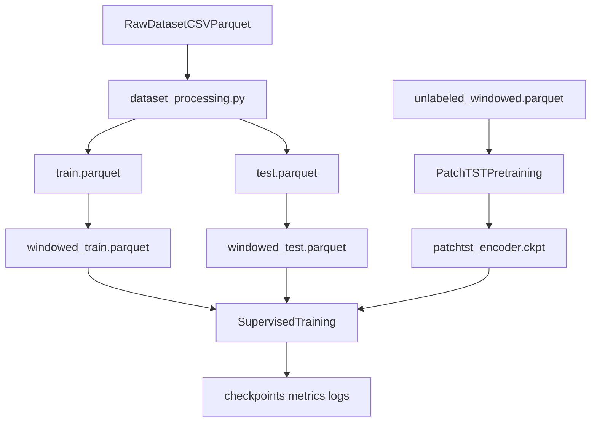

# Plano Final: Implementação Ponta a Ponta (Modular + Reprodutível + Resiliente)

## Objetivo

Entregar uma pipeline de pesquisa em padrão paper (NeurIPS/ICML): arquitetura modular clara, experimentos rastreáveis, execução robusta para treinos longos em servidor remoto, retomada automática por checkpoint e scripts por modelo + script mestre.

## Estado atual (base real do repositório)

- Modelos atuais hardcoded em `[/home/gustavo/codigos/Paper pretraining/hybrid_activity_recognition/src/hybrid_activity_recognition/models/hybrid_cnn_lstm/model.py](/home/gustavo/codigos/Paper%20pretraining/hybrid_activity_recognition/src/hybrid_activity_recognition/models/hybrid_cnn_lstm/model.py)` e `[/home/gustavo/codigos/Paper pretraining/hybrid_activity_recognition/src/hybrid_activity_recognition/models/robust_hybrid/model.py](/home/gustavo/codigos/Paper%20pretraining/hybrid_activity_recognition/src/hybrid_activity_recognition/models/robust_hybrid/model.py)`.
- `Trainer` salva apenas melhor checkpoint de validação; não há checkpoint periódico/estado completo para retomada exata em `[/home/gustavo/codigos/Paper pretraining/hybrid_activity_recognition/src/hybrid_activity_recognition/training/trainer.py](/home/gustavo/codigos/Paper%20pretraining/hybrid_activity_recognition/src/hybrid_activity_recognition/training/trainer.py)`.
- `main.py` não suporta PatchTST, nem modo pretrain, nem `deep_only` em `[/home/gustavo/codigos/Paper pretraining/hybrid_activity_recognition/src/hybrid_activity_recognition/main.py](/home/gustavo/codigos/Paper%20pretraining/hybrid_activity_recognition/src/hybrid_activity_recognition/main.py)`.
- `dataloader.py` está hardcoded para `acc_x/y/z` e mistura colunas de forma pouco extensível em `[/home/gustavo/codigos/Paper pretraining/hybrid_activity_recognition/src/hybrid_activity_recognition/data/dataloader.py](/home/gustavo/codigos/Paper%20pretraining/hybrid_activity_recognition/src/hybrid_activity_recognition/data/dataloader.py)`.
- Scripts atuais cobrem pré-processamento e um pipeline shell básico, mas não grade completa de experimentos por modelo nem execução resiliente em servidor.

## Arquitetura alvo (alto nível)

## Fase 1 — Modularização formal da arquitetura híbrida

### Arquivos novos

- `[/home/gustavo/codigos/Paper pretraining/hybrid_activity_recognition/src/hybrid_activity_recognition/models/modular/base.py](/home/gustavo/codigos/Paper%20pretraining/hybrid_activity_recognition/src/hybrid_activity_recognition/models/modular/base.py)`
- `[/home/gustavo/codigos/Paper pretraining/hybrid_activity_recognition/src/hybrid_activity_recognition/models/modular/model.py](/home/gustavo/codigos/Paper%20pretraining/hybrid_activity_recognition/src/hybrid_activity_recognition/models/modular/model.py)`
- `[/home/gustavo/codigos/Paper pretraining/hybrid_activity_recognition/src/hybrid_activity_recognition/models/modular/encoders.py](/home/gustavo/codigos/Paper%20pretraining/hybrid_activity_recognition/src/hybrid_activity_recognition/models/modular/encoders.py)`
- `[/home/gustavo/codigos/Paper pretraining/hybrid_activity_recognition/src/hybrid_activity_recognition/models/modular/tsfel_branches.py](/home/gustavo/codigos/Paper%20pretraining/hybrid_activity_recognition/src/hybrid_activity_recognition/models/modular/tsfel_branches.py)`
- `[/home/gustavo/codigos/Paper pretraining/hybrid_activity_recognition/src/hybrid_activity_recognition/models/modular/fusion.py](/home/gustavo/codigos/Paper%20pretraining/hybrid_activity_recognition/src/hybrid_activity_recognition/models/modular/fusion.py)`
- `[/home/gustavo/codigos/Paper pretraining/hybrid_activity_recognition/src/hybrid_activity_recognition/models/modular/heads.py](/home/gustavo/codigos/Paper%20pretraining/hybrid_activity_recognition/src/hybrid_activity_recognition/models/modular/heads.py)`
- `[/home/gustavo/codigos/Paper pretraining/hybrid_activity_recognition/src/hybrid_activity_recognition/models/modular/__init__.py](/home/gustavo/codigos/Paper%20pretraining/hybrid_activity_recognition/src/hybrid_activity_recognition/models/modular/__init__.py)`

### Mudanças

- Migrar implementações existentes de ramos para componentes reusáveis.
- Criar `HybridModel` com `input_mode in {deep_only, hybrid}`.
- Criar factory única (`build_hybrid_model`) para compor encoder/tsfel/fusion/head.
- Manter backward compatibility via re-export nos pacotes existentes:
  - `[/home/gustavo/codigos/Paper pretraining/hybrid_activity_recognition/src/hybrid_activity_recognition/models/hybrid_cnn_lstm/__init__.py](/home/gustavo/codigos/Paper%20pretraining/hybrid_activity_recognition/src/hybrid_activity_recognition/models/hybrid_cnn_lstm/__init__.py)`
  - `[/home/gustavo/codigos/Paper pretraining/hybrid_activity_recognition/src/hybrid_activity_recognition/models/robust_hybrid/__init__.py](/home/gustavo/codigos/Paper%20pretraining/hybrid_activity_recognition/src/hybrid_activity_recognition/models/robust_hybrid/__init__.py)`

### Critério de pronto

- Seis combinações constroem com a mesma interface `model(x_sig, x_feat)`.
- `deep_only` ignora TSFEL sem quebrar o trainer atual.

## Fase 2 — Padronização de schema e dados para extensibilidade

### Arquivo novo

- `[/home/gustavo/codigos/Paper pretraining/hybrid_activity_recognition/src/hybrid_activity_recognition/utils/schema.py](/home/gustavo/codigos/Paper%20pretraining/hybrid_activity_recognition/src/hybrid_activity_recognition/utils/schema.py)`

### Mudanças

- Generalizar `[/home/gustavo/codigos/Paper pretraining/hybrid_activity_recognition/scripts/dataset_processing.py](/home/gustavo/codigos/Paper%20pretraining/hybrid_activity_recognition/scripts/dataset_processing.py)`: `--column-map`, validação de schema canônico, split por sujeito sem vazamento.
- Generalizar `[/home/gustavo/codigos/Paper pretraining/hybrid_activity_recognition/scripts/prepare_windowed_parquet.py](/home/gustavo/codigos/Paper%20pretraining/hybrid_activity_recognition/scripts/prepare_windowed_parquet.py)`: detecção automática de canais (`acc/gyr/mag`), manifest robusto, suporte `--no-label` para pretreino.
- Atualizar `[/home/gustavo/codigos/Paper pretraining/hybrid_activity_recognition/src/hybrid_activity_recognition/data/dataloader.py](/home/gustavo/codigos/Paper%20pretraining/hybrid_activity_recognition/src/hybrid_activity_recognition/data/dataloader.py)` para detectar dinamicamente canais em vez de hardcode `acc_x/y/z`.

### Critério de pronto

- Mesmo pipeline atual continua funcionando em AcTBeCalf.
- Novo dataset com nomes diferentes roda apenas mudando `--column-map`.

## Fase 3 — PatchTST como encoder de projeto (com backend encapsulado)

### Mudanças

- Implementar `PatchTSTEncoder` em `models/modular/encoders.py` como wrapper local da interface `SignalEncoder`.
- `PatchTSTEncoder` recebe `(B, C, T)` e adapta para formato esperado do backend.
- Carregamento de encoder pretreinado isolado no próprio wrapper (`load_pretrained_encoder`).

### Decisão de design

- Troca futura para backend oficial PatchTST fica localizada nesse wrapper, sem refatorar trainer/model container.

### Critério de pronto

- `patchtst_deep` e `patchtst_hybrid` treinam com a mesma infraestrutura de `cnn_lstm` e `robust`.

## Fase 4 — Pretreino self-supervised + integração CLI

### Arquivos novos

- `[/home/gustavo/codigos/Paper pretraining/hybrid_activity_recognition/src/hybrid_activity_recognition/data/pretrain_dataset.py](/home/gustavo/codigos/Paper%20pretraining/hybrid_activity_recognition/src/hybrid_activity_recognition/data/pretrain_dataset.py)`
- `[/home/gustavo/codigos/Paper pretraining/hybrid_activity_recognition/src/hybrid_activity_recognition/training/pretrain_trainer.py](/home/gustavo/codigos/Paper%20pretraining/hybrid_activity_recognition/src/hybrid_activity_recognition/training/pretrain_trainer.py)`

### Mudanças

- Expandir `[/home/gustavo/codigos/Paper pretraining/hybrid_activity_recognition/src/hybrid_activity_recognition/main.py](/home/gustavo/codigos/Paper%20pretraining/hybrid_activity_recognition/src/hybrid_activity_recognition/main.py)`:
  - novos modos: `pretrain`, `supervised`, `test`
  - novos modelos: `cnn_lstm`, `robust`, `patchtst`
  - `--input_mode {deep_only,hybrid}`
  - `--patchtst_checkpoint` para pular pretreino
  - guardrail: se `patchtst` supervisionado sem checkpoint e sem pretrain explícito, erro claro.

### Critério de pronto

- Fluxo: `pretrain -> checkpoint -> supervised` funcional.
- Fluxo alternativo: `checkpoint existente -> supervised` funcional.

## Fase 5 — Treino resiliente para servidor remoto (dias de execução)

### Mudanças principais

- Evoluir `[/home/gustavo/codigos/Paper pretraining/hybrid_activity_recognition/src/hybrid_activity_recognition/training/trainer.py](/home/gustavo/codigos/Paper%20pretraining/hybrid_activity_recognition/src/hybrid_activity_recognition/training/trainer.py)` para salvar:
  - `best_model.pt` (melhor val)
  - `last_state.pt` (estado completo por época: modelo, otimizador, scheduler, epoch, melhor métrica, seed, args)
  - `epoch_{N}.pt` periódico (ex.: a cada `--save_every` épocas)
- Adicionar `--resume_from` no CLI para retomada exata do estado completo.
- Persistir histórico em `metrics.jsonl` por época.
- Opcional recomendado: `config_snapshot.yaml` no diretório do run.

### Critério de pronto

- Interrupção no meio do treino e retomada preservam progresso (não reinicia do zero).
- Logs e artefatos permitem auditoria reprodutível para paper.

## Fase 6 — Scripts `.sh` por modelo + script mestre

### Estrutura alvo

- `[/home/gustavo/codigos/Paper pretraining/hybrid_activity_recognition/scripts/experiments/run_cnn_lstm.sh](/home/gustavo/codigos/Paper%20pretraining/hybrid_activity_recognition/scripts/experiments/run_cnn_lstm.sh)`
- `[/home/gustavo/codigos/Paper pretraining/hybrid_activity_recognition/scripts/experiments/run_robust.sh](/home/gustavo/codigos/Paper%20pretraining/hybrid_activity_recognition/scripts/experiments/run_robust.sh)`
- `[/home/gustavo/codigos/Paper pretraining/hybrid_activity_recognition/scripts/experiments/run_patchtst.sh](/home/gustavo/codigos/Paper%20pretraining/hybrid_activity_recognition/scripts/experiments/run_patchtst.sh)`
- `[/home/gustavo/codigos/Paper pretraining/hybrid_activity_recognition/scripts/experiments/run_all.sh](/home/gustavo/codigos/Paper%20pretraining/hybrid_activity_recognition/scripts/experiments/run_all.sh)`

### Requisitos dos scripts

- Cada script roda `deep_only` e `hybrid` do seu modelo.
- `run_patchtst.sh` faz pretreino se checkpoint ausente; pula se checkpoint informado.
- Todos criam estrutura de logs e artefatos por run (`logs/`, `experiments/` com timestamp/config).
- Todos aceitam `--resume` para retomar run interrompido.
- `run_all.sh` chama os 3 scripts em sequência com fail-fast opcional e relatório final.

### Execução remota estável (SSH / terminal cair)

- Padrão de execução suportado pelos scripts:
  - `nohup bash scripts/experiments/run_all.sh > logs/run_all.out 2>&1 < /dev/null &`
- Incluir no README de experimentos instruções para:
  - iniciar em background
  - checar PID/status
  - acompanhar logs em tempo real
  - retomar run interrompido com `--resume`.

## Fase 7 — Qualidade acadêmica e legibilidade profissional

### Documentação

- Criar guia de experimentos:
  - `[/home/gustavo/codigos/Paper pretraining/hybrid_activity_recognition/docs/EXPERIMENTS.md](/home/gustavo/codigos/Paper%20pretraining/hybrid_activity_recognition/docs/EXPERIMENTS.md)`
- Atualizar README com:
  - estrutura modular
  - tabela das 6 configurações
  - comandos mínimos por cenário.

### Conteúdo mínimo da documentação

- Mapeamento claro “componente do paper -> arquivo/código”.
- Convenção de nomes de runs/checkpoints para facilitar reprodução.
- Protocolo de comparação justa (mesmo split, seed, epochs, batch, métrica).

## Fase 8 — Validação final (Definition of Done)

- Pré-processamento: train/test windowed + manifest reproduzível.
- Seis experimentos supervisionados executáveis por scripts.
- PatchTST com e sem pretreino (via checkpoint) funcionando.
- Retomada de treino validada em teste de interrupção controlada.
- Estrutura de logs/checkpoints consistente e auditável.
- Lint/imports/CLI sem regressão.

## Riscos e mitigação

- Compatibilidade de checkpoints entre classes PatchTST de pretrain e encoder.
  - Mitigação: utilitário dedicado de load com validação de chaves e log de incompatibilidades.
- Explosão de custo/tempo de treino na grade completa.
  - Mitigação: modo smoke test com poucas épocas e subset para validação de pipeline antes de rodar full.
- Mudança de schema quebrar legado.
  - Mitigação: fallback explícito para schema AcTBeCalf e testes de regressão nos scripts atuais.
