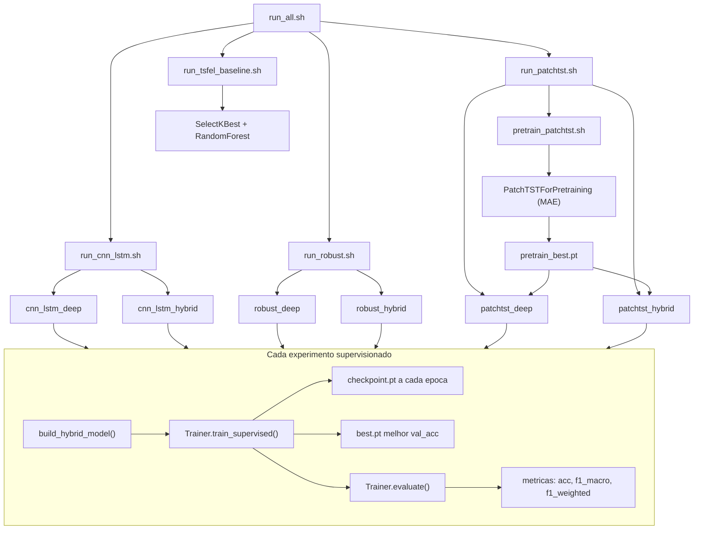
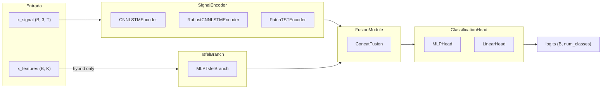

# Plano Final de Implementacao: Arquitetura Hibrida Modular

## Visao geral

Transformar o repositorio atual (2 modelos hardcoded, sem resume, um unico .sh) em uma arquitetura modular profissional com 7 experimentos automatizados (6 DL + 1 baseline), checkpointing robusto, resume de treino interrompido e execucao remota via SSH sem perda de progresso.

## Estado atual

O codigo ja funciona para 2 modelos hibridos (`HybridCNNLSTM`, `RobustHybridModel`), cada um com 4 blocos hardcoded no `__init__`. O `Trainer` salva apenas o melhor modelo por val_acc, sem checkpointing periodico nem resume. Ha um unico `.sh` que encadeia prepare + train.

Arquivos-chave existentes:

- [src/hybrid_activity_recognition/main.py](src/hybrid_activity_recognition/main.py) -- ponto de entrada CLI, `build_model()` com 2 opcoes
- [src/hybrid_activity_recognition/training/trainer.py](src/hybrid_activity_recognition/training/trainer.py) -- `Trainer` com `train_supervised()`, `finetune()`, `train_fixmatch()`, `evaluate()`
- [src/hybrid_activity_recognition/data/dataloader.py](src/hybrid_activity_recognition/data/dataloader.py) -- `CalfHybridDataset`, `prepare_train_val_test_loaders()`
- [src/hybrid_activity_recognition/layers/](src/hybrid_activity_recognition/layers/) -- `HybridCNNLSTMSignalBranch`, `RobustCNNLSTMSignalBranch`, `TsfelMLPBranch`, `ConcatFusion`, `MLPClassificationHead`
- [scripts/run_windowed_hybrid_pipeline.sh](scripts/run_windowed_hybrid_pipeline.sh) -- pipeline prepare + main (sera atualizado para apontar para `scripts/data_prep/`)

## Grade de experimentos alvo

```
                deep_only          hybrid
cnn_lstm        cnn_lstm_deep      cnn_lstm_hybrid
robust          robust_deep        robust_hybrid
patchtst        patchtst_deep      patchtst_hybrid

+ Baseline TSFEL-only (Random Forest, sem DL)
```

## Estrutura final de diretorios

```
src/
  hybrid_activity_recognition/
    main.py                         # refatorado
    data/
      dataloader.py                 # existente (mudancas minimas)
      pretrain_dataset.py           # NOVO
    layers/                         # existente (sem mudancas)
    models/
      hybrid_cnn_lstm/              # TO-DO: remove, it is a legacy file
      robust_hybrid/                # TO-DO: remove, it is a legacy file
      modular/                      # NOVO
        __init__.py                 # factory build_hybrid_model()
        base.py                    # ABCs
        model.py                   # HybridModel container
        encoders.py                # CNNLSTMEncoder, RobustCNNLSTMEncoder, PatchTSTEncoder
        tsfel_branches.py          # MLPTsfelBranch
        fusion.py                  # ConcatFusion
        heads.py                   # MLPHead, LinearHead
    training/
      trainer.py                   # refatorado: checkpoint periodico + resume explicito
      pretrain_trainer.py          # NOVO: PatchTST MAE
      loss.py, metrics.py, augment.py  # sem mudancas
    utils/
      repro.py                     # sem mudancas
      logging.py                   # NOVO: logging dual (console + arquivo)
  random_forest_baseline/          # NOVO: baseline separado do pipeline DL
    __init__.py
    tsfel_baseline.py              # SelectKBest + RandomForest, sklearn puro

scripts/
  data_prep/                       # reorganizado
    dataset_processing.py          # existente (movido de scripts/)
    prepare_windowed_parquet.py    # existente (movido de scripts/)
  experiments/                     # NOVO
    _common.sh                     # variaveis, funcao run_experiment(), convencao de nomes
    pretrain_patchtst.sh
    run_cnn_lstm.sh
    run_robust.sh
    run_patchtst.sh
    run_tsfel_baseline.sh
    run_all.sh                     # master script
    smoke_test.sh                  # validacao rapida com 2 epocas

tests/                             # NOVO: sanity checks de dimensoes
  test_encoders.py                 # forward pass com tensor falso para cada encoder
  test_fusion.py                   # forward pass de fusion + head com dims dos encoders
  test_hybrid_model.py             # forward pass end-to-end do HybridModel (deep_only e hybrid)
```

---

## Fase 1: Arquitetura Modular

### 1.1 ABCs -- `models/modular/base.py`

Quatro classes base abstratas com `output_dim` como `@abstractmethod @property`:

```python
class SignalEncoder(nn.Module, ABC):
    @property
    @abstractmethod
    def output_dim(self) -> int: ...
    def forward(self, x_signal: Tensor) -> Tensor: ...  # (B, C, T) -> (B, enc_dim)

class TsfelBranch(nn.Module, ABC):
    @property
    @abstractmethod
    def output_dim(self) -> int: ...
    def forward(self, x_features: Tensor) -> Tensor: ...  # (B, K) -> (B, proj_dim)

class FusionModule(nn.Module, ABC):
    @property
    @abstractmethod
    def output_dim(self) -> int: ...
    def forward(self, z_signal: Tensor, z_tsfel: Tensor) -> Tensor: ...

class ClassificationHead(nn.Module, ABC):
    def forward(self, z: Tensor) -> Tensor: ...  # (B, in_dim) -> (B, num_classes)
```

### 1.2 Implementacoes concretas

`**encoders.py**` -- reutiliza a logica interna de `layers/signal_branch.py`:

- `CNNLSTMEncoder(SignalEncoder)`: 2 conv blocks + BiLSTM 2 camadas, `output_dim = hidden_lstm * 2`
- `RobustCNNLSTMEncoder(SignalEncoder)`: 3 conv blocks + BiLSTM 1 camada, `output_dim = hidden_lstm * 2`

`**tsfel_branches.py**`:

- `MLPTsfelBranch(TsfelBranch)`: Linear + BN + ReLU + Dropout

`**fusion.py**`:

- `ConcatFusion(FusionModule)`: concatenacao, `output_dim = enc_dim + tsfel_dim`

`**heads.py**`:

- `MLPHead(ClassificationHead)`: Linear + ReLU + Dropout + Linear
- `LinearHead(ClassificationHead)`: Linear apenas

### 1.3 Container `HybridModel` -- `models/modular/model.py`

```python
class HybridModel(nn.Module):
    def __init__(self, encoder, tsfel_branch, fusion, head, input_mode):
        # tsfel_branch e fusion sao None quando input_mode == "deep_only"

    def forward(self, x_signal, x_features):
        z_sig = self.encoder(x_signal)
        if self.input_mode == "deep_only":
            return self.head(z_sig)
        z_ts = self.tsfel_branch(x_features)
        z = self.fusion(z_sig, z_ts)
        return self.head(z)
```

A assinatura `forward(x_signal, x_features)` e identica a atual. O `Trainer` nao precisa saber qual modo esta ativo.

### 1.4 Factory -- `models/modular/__init__.py`

```python
def build_hybrid_model(
    encoder_name: str,       # "cnn_lstm" | "robust" | "patchtst"
    input_mode: str,         # "deep_only" | "hybrid"
    num_classes: int,
    n_tsfel_feats: int,
    **encoder_kwargs,
) -> HybridModel:
```

Mapeia nomes antigos (`hybrid_cnn_lstm` -> `cnn_lstm`, `robust_hybrid` -> `robust`) para manter backward compat.

### 1.5 Backward compat (legacy com aviso)

`models/hybrid_cnn_lstm/model.py` e `models/robust_hybrid/model.py` passam a ser wrappers finos que importam de `modular` e instanciam com `input_mode="hybrid"`. No topo de cada arquivo, adicionar:

```python
# TO-DO: remove, it is a legacy file
# Use models.modular.build_hybrid_model() instead.
```

### 1.6 Testes de sanidade -- `tests/`

Testes rapidos (pytest) que validam dimensoes de tensor **antes** de rodar treino real. Previnem horas perdidas com shape mismatches.

`**tests/test_encoders.py`**:

- Para cada encoder (CNNLSTMEncoder, RobustCNNLSTMEncoder, PatchTSTEncoder):
  - Cria tensor falso `x = torch.randn(B, 3, T)` com `B=4, T=75`
  - Verifica que `encoder(x).shape == (B, encoder.output_dim)`
  - Verifica que `output_dim` e um inteiro positivo

`**tests/test_fusion.py`**:

- Testa `ConcatFusion` com tensores de dimensoes variadas
- Verifica que `fusion.output_dim == enc_dim + tsfel_dim`
- Testa `MLPTsfelBranch` com `n_features` variavel
- Testa `MLPHead` e `LinearHead` com input_dim compativel

`**tests/test_hybrid_model.py`**:

- Testa `HybridModel` end-to-end nos dois modos:
  - `deep_only`: `model(x_sig, x_feat).shape == (B, num_classes)`, x_feat ignorado
  - `hybrid`: `model(x_sig, x_feat).shape == (B, num_classes)`, ambos os ramos ativos
- Testa com cada encoder via factory `build_hybrid_model()`
- Verifica que o gradiente flui para todos os parametros com `requires_grad=True`

Execucao: `pytest tests/ -v` (ou `python -m pytest tests/ -v`). Esses testes rodam em <5 segundos, sem GPU, sem dados reais.

---

## Fase 2: PatchTST Encoder + Pretreino

### 2.1 `PatchTSTEncoder` em `encoders.py`

Wrapper do `PatchTSTModel` (HuggingFace `transformers`):

- Transpoe `(B, 3, T) -> (B, T, 3)` no forward (HF espera batch-first channels-last)
- Usa `PatchTSTConfig` com `num_input_channels=3`, `channel_attention=False`
- `pooling_type="mean"` sobre `last_hidden_state` -> `(B, d_model)`
- `output_dim = d_model` (default 128)
- `load_pretrained_encoder(path)`: carrega pesos do backbone de `PatchTSTForPretraining`, extraindo prefixo `"model."`, `strict=False`
- Hiperparametros configurados via CLI: `context_length=75`, `patch_length=8`, `patch_stride=8`, `d_model=128`, `num_heads=4`, `num_layers=3`

### 2.2 `PretrainWindowDataset` -- `data/pretrain_dataset.py`

Dataset que le o parquet janelado (com ou sem features TSFEL) e retorna apenas o tensor de sinal `(C, T)` sem label. Usado para MAE pretraining.

### 2.3 `PretrainTrainer` -- `training/pretrain_trainer.py`

- Usa `PatchTSTForPretraining` (HF) com `do_mask_input=True`, `random_mask_ratio=0.4`
- Loop de treino MAE: `out = model(past_values=x); loss = out.loss`
- Checkpoint periodico a cada N epocas
- Resume com `--resume`
- Salva `best.pt` (menor loss) e `checkpoint.pt` (estado completo para resume)

---

## Fase 3: Infraestrutura de Treino

### 3.1 Convencao de nomes para pastas de run

Cada experimento gera uma pasta nomeada com os parametros-chave para nao sobrescrever runs anteriores:

```
checkpoints/{model}_{mode}_ep{epochs}/
```

Dentro de cada pasta:

- `checkpoint.pt` -- estado completo para resume (modelo + optimizer + scheduler + contadores)
- `best.pt` -- melhor modelo por val_acc (so pesos, leve)
- `train.log` -- log completo do treino
- `DONE` -- marker de conclusao

### 3.2 Checkpointing periodico no `Trainer`

Refatorar `train_supervised()` para salvar `checkpoint.pt` a cada epoca contendo:

```python
{
    "epoch": epoch,
    "model_state_dict": model.state_dict(),
    "optimizer_state_dict": optimizer.state_dict(),
    "scheduler_state_dict": scheduler.state_dict(),
    "best_acc": best_acc,
    "best_wts": best_wts,
    "stall": stall,
}
```

### 3.3 Resume de treino interrompido -- explicito via `--checkpoint`

O resume **so acontece se o usuario passar explicitamente** o caminho do checkpoint:

```bash
python -m hybrid_activity_recognition.main \
    --mode supervised --model patchtst --input_mode hybrid \
    --checkpoint experiments/patchtst_hybrid_.../checkpoint.pt \
    ...
```

Se `--checkpoint` nao for passado, o treino comeca do zero. Sem magica, sem auto-deteccao.

Quando `--checkpoint` e passado para `train_supervised()`:

- Carrega estado do optimizer, scheduler, modelo, contadores
- Continua da epoca N+1
- Mantem `best_acc` e `stall` counter
- Log: "Resumindo treino da epoca N..."

### 3.4 Logging dual

Novo `utils/logging.py` com funcao `setup_logging(output_dir)` que configura o Python `logging` para escrever simultaneamente em console e em `{output_dir}/train.log`. Todo o output do treino vai para o arquivo de log, capturavel por `nohup`.

---

## Fase 4: Refatorar `main.py`

### Novos argumentos CLI

- `--model`: `cnn_lstm | robust | patchtst` (nomes curtos; aceita nomes antigos como alias)
- `--input_mode`: `deep_only | hybrid` (default: `hybrid` para compat)
- `--mode`: adicionar `pretrain` aos modos existentes
- `--checkpoint`: caminho para checkpoint de resume (se passado, retoma treino; se nao passado, comeca do zero)
- `--patchtst_checkpoint`: caminho para checkpoint de pretreino do PatchTST (pula pretreino se fornecido)
- `--pretrain_parquet`: parquet para pretreino PatchTST
- `--patchtst_d_model`, `--patchtst_num_layers`, `--patchtst_patch_length`, `--patchtst_patch_stride`: hiperparametros PatchTST
- `--pretrain_epochs`, `--pretrain_lr`, `--pretrain_mask_ratio`: hiperparametros pretreino
- `--checkpoint_every_n_epochs`: frequencia de checkpoint (default: 1)

### Fluxo no `main()`

```
modo pretrain:
    PretrainTrainer -> salva best.pt e checkpoint.pt na pasta da run

modo supervised:
    build_hybrid_model(encoder_name, input_mode, ...)
    se patchtst e nao tem patchtst_checkpoint -> erro claro
    se --checkpoint passado -> Trainer.train_supervised(resume_from=args.checkpoint)
    senao -> Trainer.train_supervised() do zero
    Trainer.evaluate()
```

### Compatibilidade

- `--model hybrid_cnn_lstm` continua funcionando (mapeado para `cnn_lstm` + `hybrid`)
- `--model robust_hybrid` continua funcionando (mapeado para `robust` + `hybrid`)

---

## Fase 5: Shell Scripts

### 5.1 `scripts/experiments/_common.sh`

Variaveis compartilhadas, funcao que monta o nome da pasta da run e funcao `run_experiment()`:

```bash
REPO_ROOT="$(cd "$(dirname "${BASH_SOURCE[0]}")/../.." && pwd)"
export PYTHONPATH="${REPO_ROOT}/src"

TRAIN_PARQUET="dataset/processed/AcTBeCalf/windowed_train.parquet"
TEST_PARQUET="dataset/processed/AcTBeCalf/windowed_test.parquet"
DATASET_ID="AcTBeCalf"
SEED=42
DEVICE="cuda"
EPOCHS=50
BATCH_SIZE=64
LR="1e-3"

# Monta nome da pasta: {model}_{mode}_{dataset}_ep{epochs}_bs{batch}_lr{lr}_s{seed}
make_run_dir() {
    local MODEL=$1 MODE=$2
    echo "${REPO_ROOT}/experiments/${MODEL}_${MODE}_${DATASET_ID}_ep${EPOCHS}_bs${BATCH_SIZE}_lr${LR}_s${SEED}"
}

run_experiment() {
    local MODEL=$1 MODE=$2 EXTRA_ARGS="${3:-}"
    local OUT
    OUT=$(make_run_dir "$MODEL" "$MODE")

    if [ -f "${OUT}/DONE" ]; then
        echo ">>> ${MODEL}_${MODE}: ja completo, pulando"
        return 0
    fi
    mkdir -p "${OUT}"

    # Se existe checkpoint.pt de run anterior interrompida, passa --checkpoint para resume
    RESUME_ARG=""
    if [ -f "${OUT}/checkpoint.pt" ]; then
        echo ">>> Checkpoint encontrado, resumindo..."
        RESUME_ARG="--checkpoint ${OUT}/checkpoint.pt"
    fi

    python -m hybrid_activity_recognition.main \
        --mode supervised --model "$MODEL" --input_mode "$MODE" \
        --labeled_parquet_train "$TRAIN_PARQUET" \
        --labeled_parquet_test "$TEST_PARQUET" \
        --output_dir "$OUT" \
        --epochs $EPOCHS --batch_size $BATCH_SIZE --lr $LR --seed $SEED --device $DEVICE \
        $RESUME_ARG $EXTRA_ARGS \
        2>&1 | tee -a "${OUT}/train.log"

    touch "${OUT}/DONE"
}
```

O marker `DONE` garante que re-executar o script pula experimentos ja concluidos. A deteccao de `checkpoint.pt` no .sh e o mecanismo automatico para o .sh; o usuario tambem pode passar `--checkpoint` manualmente via CLI para qualquer caminho arbitrario.

### 5.2 Scripts por modelo

`**run_cnn_lstm.sh**`:

```bash
source "$(dirname "$0")/_common.sh"
for MODE in deep_only hybrid; do
    run_experiment "cnn_lstm" "$MODE"
done
```

`**run_robust.sh**`: identico com `MODEL=robust`

`**run_patchtst.sh**`:

```bash
source "$(dirname "$0")/_common.sh"
PATCHTST_CHECKPOINT="${PATCHTST_CHECKPOINT:-}"
# Pretreino se necessario
if [ -z "$PATCHTST_CHECKPOINT" ]; then
    bash "$(dirname "$0")/pretrain_patchtst.sh"
    PRETRAIN_DIR=$(make_run_dir "patchtst" "pretrain")
    PATCHTST_CHECKPOINT="${PRETRAIN_DIR}/best.pt"
fi
for MODE in deep_only hybrid; do
    run_experiment "patchtst" "$MODE" "--patchtst_checkpoint $PATCHTST_CHECKPOINT"
done
```

`**pretrain_patchtst.sh**`: pretreino isolado, com marker DONE proprio. Tambem usa `make_run_dir` para nomear a pasta.

### 5.3 Master script `run_all.sh`

```bash
#!/usr/bin/env bash
set -euo pipefail
DIR="$(cd "$(dirname "${BASH_SOURCE[0]}")" && pwd)"

echo "=== Pipeline completo de experimentos ==="
echo "Inicio: $(date)"
echo "Para rodar em background via SSH:"
echo "  nohup bash $0 > logs/run_all.log 2>&1 &"
echo "  # ou: screen -dmS exp bash $0"
echo ""

bash "${DIR}/run_cnn_lstm.sh"
bash "${DIR}/run_robust.sh"
bash "${DIR}/run_patchtst.sh"
bash "${DIR}/run_tsfel_baseline.sh"

echo "=== Todos os experimentos concluidos: $(date) ==="
```

### 5.4 Execucao remota via SSH

Instrucoes no topo do `run_all.sh` e no README:

```bash
# Opcao 1: nohup (mais simples)
nohup bash scripts/experiments/run_all.sh > logs/run_all.log 2>&1 &
disown

# Opcao 2: screen (recomendado, permite reconectar)
screen -dmS experiments bash scripts/experiments/run_all.sh
# Reconectar: screen -r experiments

# Opcao 3: tmux
tmux new -d -s experiments 'bash scripts/experiments/run_all.sh'
# Reconectar: tmux attach -t experiments
```

---

## Fase 6: Baseline TSFEL-only

`src/random_forest_baseline/tsfel_baseline.py`: modulo separado, sklearn puro, sem PyTorch.

- SelectKBest + RandomForest
- Le os mesmos parquets janelados
- Imprime accuracy, F1 macro, F1 weighted
- Nenhuma dependencia do pacote `hybrid_activity_recognition`
- Executavel via: `PYTHONPATH=src python -m random_forest_baseline.tsfel_baseline --train ... --test ...`
- O `.sh` correspondente (`run_tsfel_baseline.sh`) chama este modulo

---

## Fase 7: Smoke Test de Integracao

Validacao minima para garantir que tudo conecta antes de rodar na maquina remota:

- Criar um script `scripts/experiments/smoke_test.sh` que roda cada um dos 6 experimentos DL + pretreino por apenas 2 epocas, batch pequeno
- Verifica que os 6 checkpoints foram criados
- Verifica que o baseline TSFEL roda sem erro
- Se tudo passar, a grade completa esta pronta para a maquina remota

---

## Diagrama de fluxo de execucao




## Diagrama da arquitetura modular




## Dependencias a adicionar

Adicionar ao `requirements.txt`:

- `transformers>=4.36.0` (PatchTST esta disponivel desde ~4.36)

---

## Resumo de arquivos

**Novos (16 arquivos)**:

- `src/.../models/modular/__init__.py`, `base.py`, `model.py`, `encoders.py`, `tsfel_branches.py`, `fusion.py`, `heads.py`
- `src/.../data/pretrain_dataset.py`
- `src/.../training/pretrain_trainer.py`
- `src/.../utils/logging.py`
- `src/random_forest_baseline/__init__.py`, `tsfel_baseline.py`
- `tests/test_encoders.py`, `tests/test_fusion.py`, `tests/test_hybrid_model.py`

**Novos (.sh, 8 arquivos)**:

- `scripts/experiments/_common.sh`, `pretrain_patchtst.sh`, `run_cnn_lstm.sh`, `run_robust.sh`, `run_patchtst.sh`, `run_tsfel_baseline.sh`, `run_all.sh`, `smoke_test.sh`

**Modificados (4 arquivos)**:

- `src/.../main.py` -- novos args, novo modo pretrain, usa factory modular
- `src/.../training/trainer.py` -- checkpoint periodico + resume explicito via --checkpoint
- `src/.../models/hybrid_cnn_lstm/model.py` -- re-exporta de modular, marcado `TO-DO: remove, it is a legacy file`
- `src/.../models/robust_hybrid/model.py` -- re-exporta de modular, marcado `TO-DO: remove, it is a legacy file`

**Movidos (2 arquivos)**:

- `scripts/dataset_processing.py` -> `scripts/data_prep/dataset_processing.py`
- `scripts/prepare_windowed_parquet.py` -> `scripts/data_prep/prepare_windowed_parquet.py`

**Sem mudancas**: `layers/`*, `data/dataloader.py`, `training/loss.py`, `training/metrics.py`, `training/augment.py`, `utils/repro.py`
